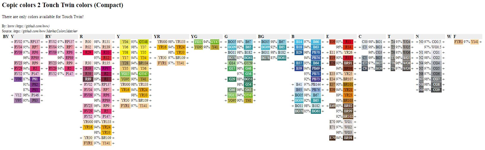

# MarkesColorsMatcher

Generator of color matching tables between Copic and Touch Twin markers for artists.

## Usage:

To make full table 

```bash
bash> ./copic_to_touch.rb > copic_to_touch.html
```

To make table with only rechargeable inks

```bash
bash> ./copic_to_touch.rb inkonly > copic_to_touch.html
```

## Result

To see result just open HTML file with your browser. It should look like:


*Legend:* *Inc* - _rechargeable_, *Match%* - precents of color match 

## Full table in compact format

Full table with compact format


## Rechargeable version of Touch Twin only

The next table includes only rechargeable TouchTwin version.



## Note

* Use at your own risk. I can't guarantee the exact colors that will apear on paper.
* The tool can be used for other markers, too.
