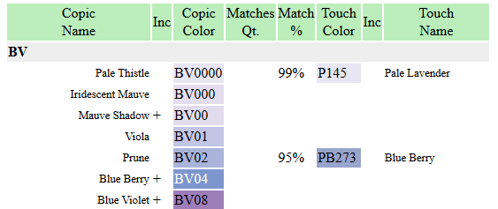

# MarkesColorsMatcher

Generator of color matching tables between: Copic, Touch Twin, etc

## Usage:

bash> ./copic_to_touch.rb > copic_to_touch.html

## Result

To see result just open HTML file with your browser. It should look like:

*Legend* Inc - _rechargable_, Match% - precents of color match 

Full table with compact format

## Note
* Use for your own risk. I can't guaranty exact colors on paper.
* Can be used for other markers too
